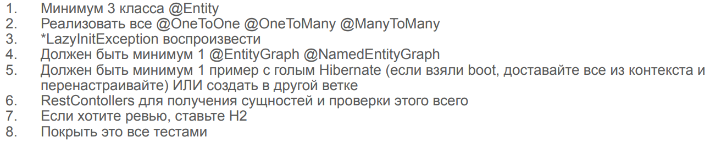

# Hibernate & Entity Graphs

Домашнее задание на стажировке в компании Aston.

Задание выполнено в полном объёме, и даже перевыполнено :slightly_smiling_face:	Весь проект реализован на голом
Hibernate и Spring Core, написаны Entity Graphs и один NamedEntityGraph. Задание по воспроизводству 
LazyInitializationException выполняется, если закрыть любой EntityGraph.

Как такового метода main или другого способа вводить/выводить данные нет. Правильность
работы всех методов проверяется при помощи JUnit-тестов.